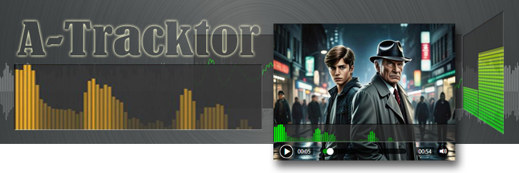

# 

The Javascript library contains a set of widgets to visualize audio data  
and add a customizable media player to a web page.

> Сменить язык: [](README.ru.md) [](README.md)

## Used technologies

  * [Web Audio API](https://developer.mozilla.org/en/docs/Web/API/Web_Audio_API)
  * [Typescript](http://www.typescriptlang.org/)
    
## Description

The library contains a set of widgets to visualize audio data on a web page.

## Documentation

See detailed documentation with examples of usage and installation
[here](https://examples.sadspace.ru/a-tracktor/docs/).

## Live demo

Try the [live demo](https://examples.sadspace.ru/a-tracktor)

## Development

### Source files

  All the source files are placed under the [/src](./src) folder
  
### Build files

 Production files are placed under the `/dist` folder.

### Setup

```
yarn
```

### Compiles and hot-reloads for development
```
yarn start
```

### Compiles and minifies for production
```
yarn build
```

### Build the docs
```
yarn docs
```

### Build the demo project
```
yarn build:demo
```

### Publish the package on `npm` storage 
```
yarn npm-publish
```

## License

ISC

## Credits

  MrDigger © [SAD-Systems](https://sad-systems.github.io), 2025
